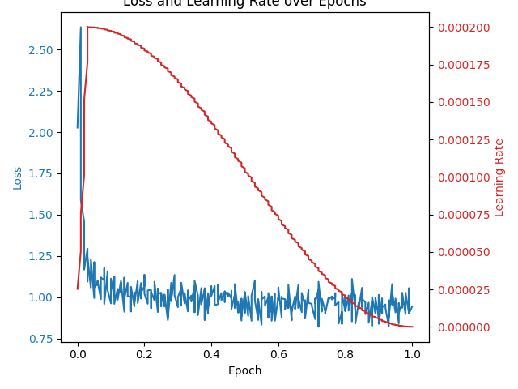

# Deploying LLM Fine-Tuned Model with LoRA and Quantization on AWS using CI/CD

This project involves the fine-tuning of a large language model (LLM) using Low-Rank Adaptation (LoRA) and quantization techniques. The fine-tuned model is deployed on AWS to leverage its scalable infrastructure and managed services.

#### Loss and Cosine Learning rate scheduler

initial learning rate = 2e-4 , 

r_scheduler_type = "cosine"